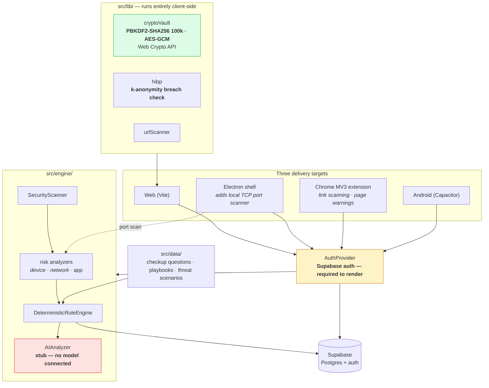

# SurakshaScore MVP

Early MVP of SurakshaScore — a personal digital safety and cyber hygiene toolkit.

> **This is the prototype, not the main project.**
> This repository is the first working version of SurakshaScore, kept as a
> record of where the idea started. The project was later rebuilt from scratch
> as **[surakshascore](https://github.com/sgtsujith141-wq/surakshascore)** —
> that is the main, evolved version and the one to look at first.
>
> This MVP is preserved because it is where the core ideas were first proven:
> a guided security checkup, remediation playbooks, a client-side encrypted
> vault, and a breach check that never transmits the password. The rewrite kept
> those ideas and replaced the engine around them.

[](https://github.com/sgtsujith141-wq/surakshascore-mvp/actions/workflows/ci.yml)
[](#status)
[](https://github.com/sgtsujith141-wq/surakshascore)

> **No screenshots in this README.** The app requires a configured Supabase
> project to render anything past its configuration screen, so any screenshot
> here would either be of that configuration screen or would need a live
> backend. Rather than stage one, the running UI is shown in the successor
> repository, [surakshascore](https://github.com/sgtsujith141-wq/surakshascore#readme),
> which runs standalone.

## What this MVP does

- **Security checkup** — a staged scan across device, app, network and account
  signals, producing scored findings grouped by severity.
- **Guided playbooks** — each finding links to a step-by-step remediation
  playbook rather than just naming the problem.
- **Security habits assessment** — a questionnaire covering the behavioural side
  (password reuse, 2FA coverage, phishing response) that a scan cannot observe.
- **Password breach check** — queries the Have I Been Pwned range API using
  k-anonymity (SHA-1, 5-character prefix), so neither the password nor its full
  hash ever leaves the browser.
- **Local vault** — credential storage encrypted client-side with a master
  password (PBKDF2-SHA256, 100,000 iterations, AES-GCM, via the Web Crypto API).
- **Learn section** — threat scenarios and explanatory content.

Two companion pieces ship alongside the web app:

- `extension/` — a Manifest V3 Chrome extension for link scanning and
  page-level phishing warnings.
- `electron/` — an Electron wrapper whose main process adds a local TCP port
  scanner, which a browser cannot perform.

## What changed in the rewrite

The main `surakshascore` repository is a clean-room rebuild, not a fork of this
code. The most significant differences:

| | This MVP | surakshascore |
|---|---|---|
| Scoring | Risk analyzers per category | Pure, deterministic scoring function with a published breakdown |
| Data honesty | Mixed | Every data point carries a provenance tier (`VERIFIED` / `PERMISSION_BASED` / `SELF_REPORTED` / `UNAVAILABLE`) |
| Tests | None | 107 unit tests |
| Backend | Supabase required | No backend |

## Architecture

Where this MVP's design differs most from the rewrite is that persistence and
identity are external: Supabase is on the critical path for the app to render at
all, and the risk logic is spread across per-domain analyzers rather than
concentrated in one pure scoring function.



### The two pieces worth reading

**`src/lib/cryptoVault.ts`** — the zero-knowledge vault. A master password is
stretched with PBKDF2-SHA256 at 100,000 iterations over a per-vault salt, and
the derived key encrypts entries with AES-GCM through the Web Crypto API. The
master password and the derived key never leave the browser and are never sent
to Supabase; only ciphertext is stored. This survived into the rewrite as a
design principle.

**`src/lib/hibp.ts`** — the breach check. SHA-1 of the password is computed
locally, only the first five hex characters are sent to the Have I Been Pwned
range endpoint, and the suffix is matched against the returned range in the
browser. Neither the password nor its full hash is transmitted.

## Engineering decisions and trade-offs

**Supabase for auth and persistence.** It bought working authentication, a
Postgres schema and row-level security without writing a backend, which is the
right call for proving a product idea quickly. *Trade-off, and the one that
drove the rewrite:* it put a network dependency on the critical path of a
security app. Without credentials the app renders a configuration screen and
nothing else — there is no offline or local-only mode. The successor has no
backend at all.

**Client-side encryption rather than server-side.** The vault was built so that
compromising the database yields ciphertext only. *Trade-off:* a forgotten
master password is unrecoverable by design, and there is no sharing or sync.

**A stub where the AI was going to be.** `AIAnalyzer` returns a deterministic
interpretation of rule-engine flags and reports `INSUFFICIENT_EVIDENCE` when
given nothing. Leaving a documented stub is better than wiring a model that
would emit unbounded security claims — and the rewrite made that permanent by
generating all copy from typed templates instead.

**Risk logic split across per-domain analyzers.** `deviceRiskAnalyzer`,
`networkRiskAnalyzer` and `appRiskAnalyzer` each own their scoring.
*Trade-off:* no single place defines how the overall number is produced, so it
cannot be shown to the user as a derivation or unit-tested as a whole. Replacing
this with one pure scoring function was the main structural change in the
rewrite.

**Three delivery targets from one codebase.** Web, Electron and a Chrome
extension, plus Capacitor for Android. The Electron main process does what a
browser cannot — a local TCP port scan. *Trade-off:* four build paths to keep
working, and capability now varies per target.

## Verified status

Checked on the current commit:

| Check | Command | Result |
|---|---|---|
| Typecheck | `npm run typecheck` | **Passes** |
| Production build | `npm run build` | **Passes** |
| Lint | `npm run lint` | **206 errors** — 121 `no-explicit-any`, 76 `no-unused-vars`, 9 `prefer-const` |
| Tests | — | **None.** The rewrite has 107. |

The 206 lint errors are pre-existing and are recorded rather than fixed: this is
an archived prototype and the effort belongs in the successor. CI runs lint as a
separate, clearly-labelled informational job that is **expected to fail**; the
rules have not been relaxed to produce a green badge. Typecheck and build are
the gating checks.

## Tech stack

React 18 · TypeScript · Vite · Tailwind CSS · Supabase (auth + Postgres) ·
Capacitor (Android) · Electron · Recharts · Lucide icons · ESLint.

## How to run it

Supabase credentials are required — the app shows a "Configuration Required"
screen without them.

```bash
npm install
cp .env.example .env     # then fill in VITE_SUPABASE_URL and VITE_SUPABASE_ANON_KEY
npm run dev
```

Apply `supabase/migration/20260813122249_create_digital_security_schema.sql` to
your Supabase project to create the expected tables.

Other targets:

```bash
npm run typecheck     # tsc --noEmit
npm run lint          # eslint
npm run build         # production build to dist/
npm run electron:dev  # Vite dev server + Electron shell
npm run electron:build
```

Android via Capacitor (requires Android Studio and the Android SDK):

```bash
npm run build
npx cap sync android
npx cap open android
```

The Chrome extension loads unpacked: `chrome://extensions` → Developer mode →
Load unpacked → select `extension/`.

## Status

Prototype. Feature work has stopped here — active development continues in
[surakshascore](https://github.com/sgtsujith141-wq/surakshascore). The build is
clean (`npm run build`) and typecheck passes, but several subsystems are
scaffolding rather than finished features. Stated plainly:

- **`src/engine/AIAnalyzer.ts` is a stub.** No LLM is connected. It returns a
  deterministic interpretation of flags produced by `DeterministicRuleEngine`,
  and reports `INSUFFICIENT_EVIDENCE` when given nothing to work with. The
  "AI analysis" surface in the UI is backed by this, not by a model.
- **Android native signals are partial.** `AndroidSecurityAdapter` defines the
  interface for device-integrity signals, but the network group — connection
  type, TLS status, Wi-Fi security, VPN state and DNS config — returns
  `UNSUPPORTED` with "Native scan not implemented". Those surfaces render as
  unavailable on a real device rather than producing findings.
- **`GmailService` requires an OAuth access token** that no flow in the app
  currently obtains. The email threat-scanning path is unreachable in the
  shipped UI.
- The port scanner works only in the Electron build. It is unavailable in the
  browser and on Android by design.
- No test suite. (The rewrite has one.)

The password breach check, the client-side encrypted vault, the rule engine, the
checkup flow and the playbooks are implemented and functional.

## A note on internal identifiers

The rename to SurakshaScore MVP covered user-facing branding and package
metadata. Internal identifiers still read `sentinel` on purpose:

- the Android `applicationId` / `namespace` (`com.sentinel.security`), its Java
  and Kotlin package directories, and the matching OAuth `custom_url_scheme` and
  `redirectTo` callback
- the Capacitor bridge plugin names (`SentinelDeviceScanner` and siblings), which
  must match the `@CapacitorPlugin(name = ...)` annotations in the Kotlin source
- the `sentinel_vault` storage key and the `#sentinel-*` CSS hooks shared
  between the extension's stylesheet and its content script

Changing any of these would break the Android build, the OAuth callback, the
native bridge, or an existing user's stored vault, for no user-visible benefit.

## Repository contents

- `src/screens/` — Home, Checkup, Issues, Playbook, Habits, Tools, Vault, Learn,
  Diagnostics, Settings, Auth
- `src/engine/` — rule engine, risk analyzers, scanners, threat engines
- `src/platform/` — platform adapters and threat-intelligence interfaces
- `src/lib/` — Supabase client, crypto vault, HIBP client
- `src/data/` — checkup questions, playbooks, threat scenarios
- `supabase/migration/` — database schema
- `extension/`, `electron/`, `android/` — companion targets
